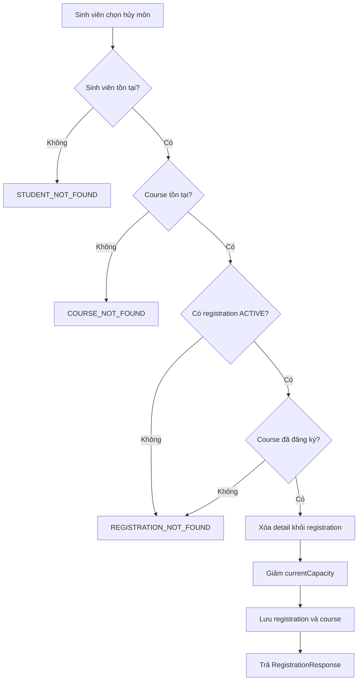

# Flowchart hủy đăng ký

```mermaid
flowchart TD
  Start["Sinh viên chọn hủy môn"] --> StudentExists{"Sinh viên tồn tại?"}
  StudentExists -- Không --> StudentError["STUDENT_NOT_FOUND"]
  StudentExists -- Có --> CourseExists{"Course tồn tại?"}
  CourseExists -- Không --> CourseError["COURSE_NOT_FOUND"]
  CourseExists -- Có --> ActiveReg{"Có registration ACTIVE?"}
  ActiveReg -- Không --> RegError["REGISTRATION_NOT_FOUND"]
  ActiveReg -- Có --> Registered{"Course đã đăng ký?"}
  Registered -- Không --> RegError
  Registered -- Có --> Remove["Xóa detail khỏi registration"]
  Remove --> Decrease["Giảm currentCapacity"]
  Decrease --> Save["Lưu registration và course"]
  Save --> Response["Trả RegistrationResponse"]
```

