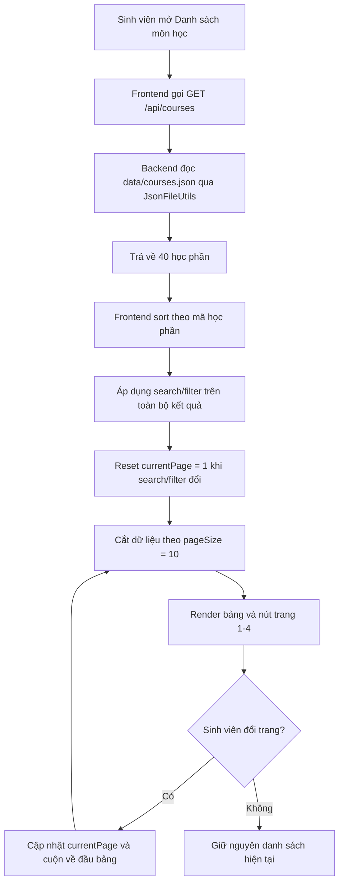

# Flowchart phân trang học phần

```mermaid
flowchart TD
  A["Sinh viên mở Danh sách môn học"] --> B["Frontend gọi GET /api/courses"]
  B --> C["Backend đọc data/courses.json qua JsonFileUtils"]
  C --> D["Trả về 40 học phần"]
  D --> E["Frontend sort theo mã học phần"]
  E --> F["Áp dụng search/filter trên toàn bộ kết quả"]
  F --> G["Reset currentPage = 1 khi search/filter đổi"]
  G --> H["Cắt dữ liệu theo pageSize = 10"]
  H --> I["Render bảng và nút trang 1-4"]
  I --> J{"Sinh viên đổi trang?"}
  J -- "Có" --> K["Cập nhật currentPage và cuộn về đầu bảng"]
  K --> H
  J -- "Không" --> L["Giữ nguyên danh sách hiện tại"]
```

Quy tắc: frontend không đọc trực tiếp `data/*.json`; dữ liệu thật đi qua backend API trước, phân trang chỉ là trình bày giao diện.
