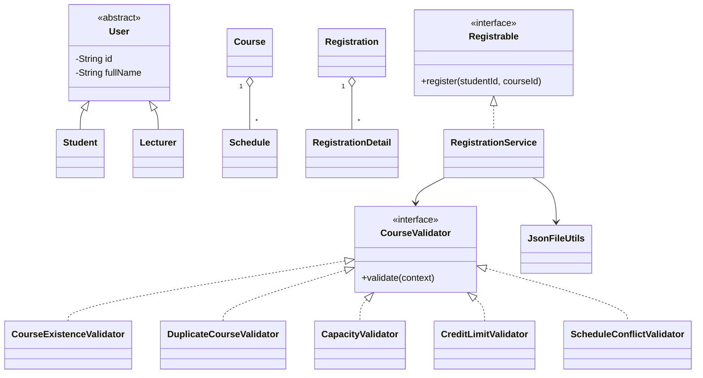

# Class diagram

```mermaid
classDiagram
  class User {
    <<abstract>>
    -String id
    -String fullName
  }
  class Student
  class Lecturer
  class Course
  class Schedule
  class Registration
  class RegistrationDetail
  class Registrable {
    <<interface>>
    +register(studentId, courseId)
  }
  class CourseValidator {
    <<interface>>
    +validate(context)
  }
  class RegistrationService
  class JsonFileUtils

  User <|-- Student
  User <|-- Lecturer
  Course "1" o-- "*" Schedule
  Registration "1" o-- "*" RegistrationDetail
  Registrable <|.. RegistrationService
  CourseValidator <|.. CourseExistenceValidator
  CourseValidator <|.. DuplicateCourseValidator
  CourseValidator <|.. CapacityValidator
  CourseValidator <|.. CreditLimitValidator
  CourseValidator <|.. ScheduleConflictValidator
  RegistrationService --> CourseValidator
  RegistrationService --> JsonFileUtils
```

Source đầy đủ nằm tại `class-diagram.mmd`.

