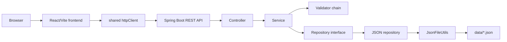

# Component diagram

```mermaid
flowchart LR
  Browser["Browser"]
  React["React/Vite frontend"]
  ApiClient["shared httpClient"]
  Spring["Spring Boot REST API"]
  Controller["Controller"]
  Service["Service"]
  Validator["Validator chain"]
  Repository["Repository interface"]
  JsonRepo["JSON repository"]
  FileUtils["JsonFileUtils"]
  Data["data/*.json"]

  Browser --> React
  React --> ApiClient
  ApiClient --> Spring
  Spring --> Controller
  Controller --> Service
  Service --> Validator
  Service --> Repository
  Repository --> JsonRepo
  JsonRepo --> FileUtils
  FileUtils --> Data
```

