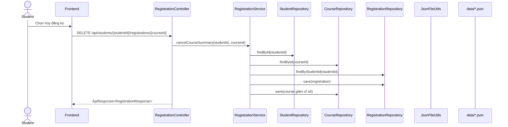

# Sequence hủy đăng ký

```mermaid
sequenceDiagram
  actor Student
  participant Frontend
  participant RegistrationController
  participant RegistrationService
  participant StudentRepository
  participant CourseRepository
  participant RegistrationRepository
  participant JsonFileUtils
  participant JSON as data/*.json

  Student->>Frontend: Chọn hủy đăng ký
  Frontend->>RegistrationController: DELETE /api/students/{studentId}/registrations/{courseId}
  RegistrationController->>RegistrationService: cancelCourseSummary(studentId, courseId)
  RegistrationService->>StudentRepository: findById(studentId)
  RegistrationService->>CourseRepository: findById(courseId)
  RegistrationService->>RegistrationRepository: findByStudentId(studentId)
  RegistrationService->>RegistrationRepository: save(registration)
  RegistrationService->>CourseRepository: save(course giảm sĩ số)
  RegistrationController-->>Frontend: ApiResponse<RegistrationResponse>
```

