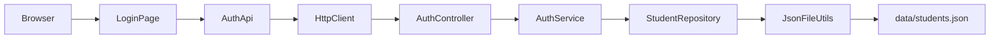
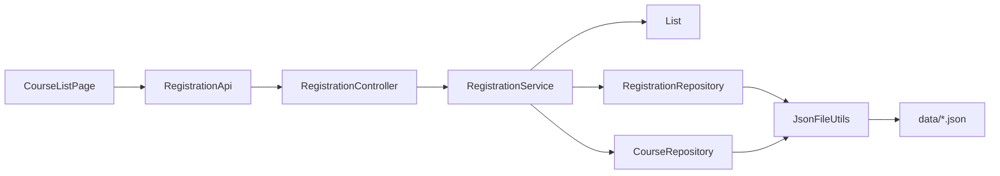

# Luồng dữ liệu

## Login


```mermaid
flowchart LR
  Browser --> LoginPage
  LoginPage --> AuthApi
  AuthApi --> HttpClient
  HttpClient --> AuthController
  AuthController --> AuthService
  AuthService --> StudentRepository
  StudentRepository --> JsonFileUtils
  JsonFileUtils --> StudentsJson["data/students.json"]
```

## Đăng ký môn học


```mermaid
flowchart LR
  CourseListPage --> RegistrationApi
  RegistrationApi --> RegistrationController
  RegistrationController --> RegistrationService
  RegistrationService --> ValidatorList["List<CourseValidator>"]
  RegistrationService --> RegistrationRepository
  RegistrationService --> CourseRepository
  RegistrationRepository --> JsonFileUtils
  CourseRepository --> JsonFileUtils
  JsonFileUtils --> DataJson["data/*.json"]
```

## Thời khóa biểu

```text
Student
-> ACTIVE Registration
-> Course
-> Schedule
-> Lecturer
-> Timetable response
```

